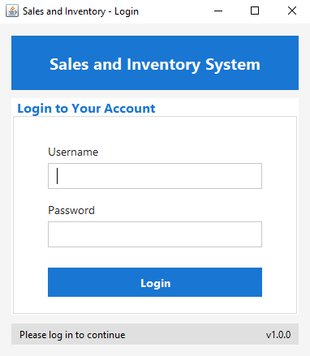
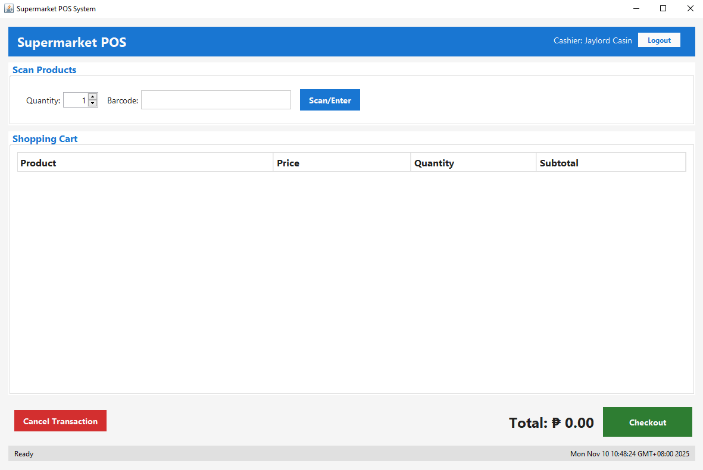
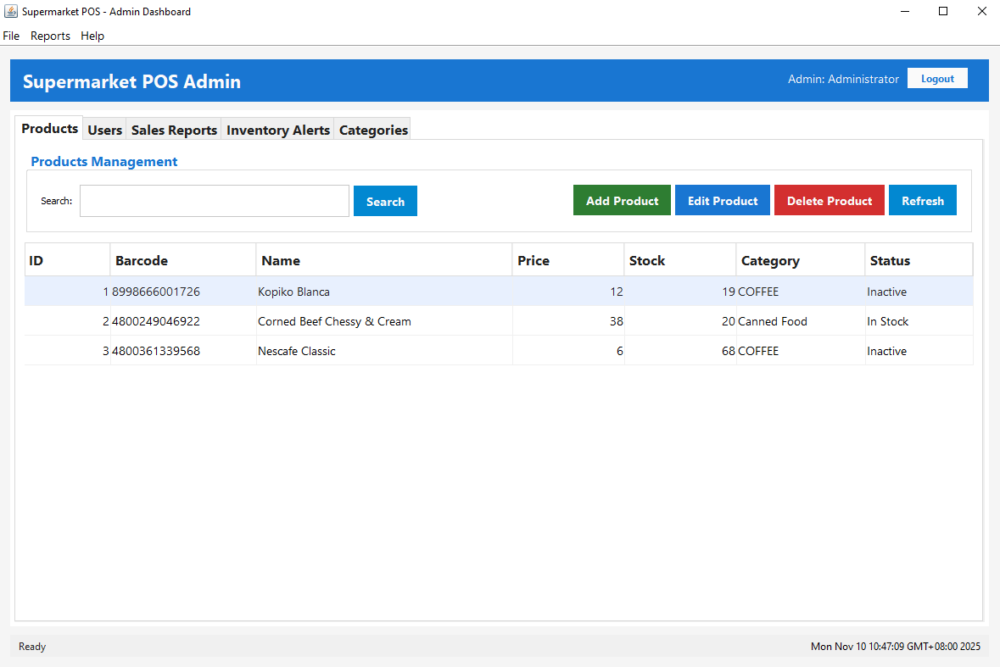

<h1 align="center">🛒 POS & Inventory Management System</h1>

A comprehensive desktop-based Point of Sale (POS) solution built with Java Swing and MySQL. 
Designed to streamline retail operations — from inventory control to sales tracking — while integrating barcode scanning and receipt generation via JasperReports.

  
  
  
  

---

<h3 align="center">✨ Key Features</h3>

- 💳 **Sales & Billing** — Efficiently process transactions with barcode scanner integration.
- 📦 **Inventory Management** — Track stock levels, categories, and supplier details in real time.
- 👥 **User Roles & Security** — Role-based access for Admins, Cashiers, and Managers.
- 🧾 **Receipt & Report Generation** — Generate detailed sales and inventory reports using JasperReports.
- 🏪 **Product Management** — Add, update, and delete items with automatic stock adjustments.
- 📈 **Sales Analytics Dashboard** — Monitor performance trends and daily revenue insights.
- 🔍 **Barcode Scanner Support** — Seamless integration for fast checkout in supermarkets.

---

<h3 align="center">🛠️ Tech Stack</h3>

  
  
  
  

---

<h3 align="center">⚙️ System Architecture</h3>

**Modules:**

1. 🧾 Sales & Billing Module
2. 📦 Inventory Module
3. 👤 User Management
4. 📊 Reporting Module (via JasperReports)
5. ⚙️ System Configuration

**Database:** MySQL  
**UI Framework:** Java Swing  
**Reports Engine:** JasperReports  
**Hardware Integration:** Barcode Scanner (USB or Serial Input)

---

<h3 align="center">🚀 Getting Started</h3>

**Prerequisites:**

- Java JDK 8 or later
- MySQL Server
- MySQL Connector/J
- JasperReports Library
- Eclipse IDE (or any Java IDE)

<h3 align="center">📸 Screenshots</h3>

Below are some preview screens of the system interface:

🔐 <b>Login Page</b>

  

💰 <b>Billing / POS Interface</b>

  

📈 <b>Dashboard Overview</b>

  

---

<h3 align="center">📄 License</h3>

  This project is licensed under the <b>MIT License</b> — you are free to use, modify, and distribute it.

---

<h3 align="center">💡 Developed By</h3>

  <b>Jaylord Casin</b> 
  Java Developer | System Analyst 
  📧 <a href="mailto:your.email@example.com">superrjay01@gmail.com</a>

